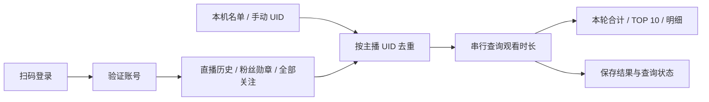

<div align="center">

# BiliWatch

**用一个桌面窗口，整理你的 B 站直播观看时长。**


扫码登录 · 自动发现主播 · 累计时长统计 · TOP 10 排行榜

[快速开始](#快速开始) · [使用方法](#使用方法) · [开发与构建](#从源码构建) · [常见问题](#常见问题)

</div>

BiliWatch 是一个中文 Windows 桌面工具。登录自己的 B 站账号后，它会合并**直播历史、粉丝勋章、全部关注和本机保存的主播名单**，按主播 UID 去重，再逐个查询观看时长。

> **已发现直播间的合计，不等于已证实的全站历史总时长。** 可查询的名单可能不完整，统计起点以 B 站接口为准。

## 功能

| 功能 | 说明 |
| --- | --- |
| 扫码登录 | 使用哔哩哔哩 App 扫码，无需手动复制 Cookie |
| 自动发现主播 | 分页获取直播历史、粉丝勋章和全部关注，分别显示获取状态 |
| 时长概览 | 本轮合计小时数、成功数、失败数和待查询数 |
| TOP 10 | 按本轮成功查询的累计观看时长排序 |
| 主播明细 | 按昵称或 UID 搜索、点击表头排序，查看来源和更新时间 |
| 取消与续查 | 保留已完成结果，继续剩余名单或单独重试失败项 |
| 手动补充 | 输入主播 UID，扩展自动发现之外的名单 |
| 本机缓存 | 按账号保存结果，重启恢复；登录状态经 Windows DPAPI 加密 |

## 界面

浅色中文界面采用统一的概览区、查询工具栏和数据工作区。主播明细位于左侧，右侧展示 TOP 10；状态以文字和彩色标签共同区分。搜索和 UID 输入框提供可见提示，无匹配结果时给出说明。小窗口支持明细横向滚动与排行榜独立滚动，扫码窗口沿用相同视觉样式。

## 快速开始

### 下载单文件免安装版

**[下载 BiliWatch.exe（Windows x64）](https://github.com/BUNNY-19C/BiliWatch/releases/latest/download/BiliWatch.exe)** · [版本说明](https://github.com/BUNNY-19C/BiliWatch/releases/latest)

下载后直接双击运行，不需要安装程序、不需要另装 .NET，也不需要配套 DLL 或解压 ZIP。EXE 已包含程序、二维码库和 .NET / WPF 运行时。

首次启动时，运行时会自动将必要的本机库释放到 Windows 临时目录；账号缓存仍保存在 `%LOCALAPPDATA%\BiliWatch`。免安装不表示运行时不会生成缓存文件。

### 从源码运行

在 **Windows x64** 上安装 Git 和 **.NET 8 SDK**，然后执行：

```powershell
git clone https://github.com/BUNNY-19C/BiliWatch.git
cd BiliWatch
dotnet run --project BiliWatch.App/BiliWatch.App.csproj -c Release
```

自行生成单文件程序的方法见[从源码构建](#从源码构建)。

## 使用方法

1. 从 Releases 下载 `BiliWatch.exe`，双击运行。
2. 点击右上角“扫码登录”，用哔哩哔哩手机 App 扫一扫并确认。二维码过期后可以刷新。
3. 点击“开始查询”。程序先获取主播名单，再逐个查询；请求起始间隔至少 1 秒，数百位主播需要数分钟。
4. 可随时“取消”，然后使用“继续待查询项”。“重试失败项”只重试本轮失败的主播，不会重复累加成功结果。
5. 补充主播时输入个人空间的数字 UID，可用逗号分隔多个 UID。UID 是 `space.bilibili.com/` 后的数字，不是直播间号。
6. 搜索框可筛选主播名或 UID，点击表头可排序；悬停明细行查看失败原因。窗口较窄时，明细可横向滚动。

### 统计含义

- “本次成功查询合计”是当前这一轮成功返回的 `watch_time` 秒数之和。正常返回的零计为成功；缺少时长或请求失败不会算作零。
- “开始查询”会创建新一轮；旧时长继续保留在明细中并标注更新时间，但只有本轮再次成功查询后才计入合计。
- 关闭重开会恢复最近一轮的结果和待查询项。来源未完整获取会在来源状态中注明。若名单发现中断，重新“开始查询”可重新发现；“继续待查询项”只处理已保存的名单。
- 历史记录、勋章和关注列表不能保证枚举所有曾看过的主播。合计不等于已证实的账号注册以来全站总时长；统计起点以 B 站接口为准。它也不表示多直播间同时观看时去重后的实际经过时间。
- 第一版只提供手动启动的批量查询，不提供后台定时同步或历史趋势。

### 本机数据

数据保存在 `%LOCALAPPDATA%\BiliWatch`，按登录 UID 分开保存。`session.bin` 由当前 Windows 用户的 DPAPI 加密，登录凭据不写入日志。退出按钮删除本机登录状态，保留查询缓存；不会调用 B 站全设备退出。

网络超时或连接失败最多额外重试两次；明确的未登录或风控响应暂停任务。重新扫码或等待后，可重试失败项及继续待查询项。

## 从源码构建

需要 Windows x64 和 .NET 8 SDK。运行程序的用户无需另外安装 .NET，发布包自带运行时。仅直接引用 QRCoder 1.8.0；其余实现使用 .NET / Windows 组件。

```powershell
dotnet build BiliWatch.App/BiliWatch.App.csproj -c Release
dotnet run --project BiliWatch.Tests/BiliWatch.Tests.csproj -c Release
dotnet publish BiliWatch.App/BiliWatch.App.csproj -c Release -p:PublishProfile=Portable -o publish/BiliWatch
```

输出为 `publish/BiliWatch/BiliWatch.exe` 一个文件。发布配置保存在 `BiliWatch.App/Properties/PublishProfiles/Portable.pubxml`，启用自带运行时、单文件和压缩；WPF 不做裁剪。QRCoder 和 .NET / WPF 的许可证及第三方声明见 [THIRD-PARTY-NOTICES.txt](THIRD-PARTY-NOTICES.txt)，也作为资源内置于 EXE。

默认中间产物放在源码目录 `.artifacts`。可通过环境变量 `BILIWATCH_BUILD_ROOT` 指定另一绝对目录（需带末尾反斜杠）。`BILIWATCH_DATA_DIR` 可覆盖本机数据目录，便于隔离测试。不得把真实登录凭据提交进源码或测试夹具。

真实接口验收须先在程序内扫码，然后运行：

```powershell
dotnet run --project BiliWatch.Tests/BiliWatch.Tests.csproj -c Release -- --live --report live-verification.json
```

这会从本机加密会话读取登录态，抽查前三位粉丝勋章主播，报告只包含 UID、昵称和时长，不输出 Cookie。少于三位或未登录会返回非零退出码，不能当成验收成功。生成的报告包含个人观看信息，不应随源码公开发布。

## 结构

- `BiliWatch.Core`：接口访问、扫码状态、分页发现、批量查询、统计、本机 JSON 与 DPAPI 存储。
- `BiliWatch.App`：WPF 窗口、MVVM 绑定、二维码渲染、任务操作及错误提示。
- `BiliWatch.Tests`：无需额外测试框架的回归测试可执行程序，测试失败返回非零退出码；`--live` 为真实接口抽查。

接口请求只使用固定 B 站 HTTPS 主机，不接受用户输入 URL，不自动跟随重定向。历史与勋章用于发现 UID，实际时长统一来自 `GuardActive`。没有使用网页模拟观看或心跳上报。



## 验证情况

2026-10-08 的本地验收结果：

- **19 项回归测试通过**：覆盖去重、有效零值、缺失字段、统计隔离、分页停止、取消、失败重试、登录失效、风控暂停、账号缓存隔离和 DPAPI。
- 真实账号完成 **419 位主播**的查询，无失败；抽查三位主播，接口秒数、缓存与界面换算一致。
- 已验证扫码登录、按 UID 搜索、取消续查、重启恢复、普通及最大化窗口布局，以及使用包内运行时启动。

以上为一次实测记录，不代表 B 站接口未来保持不变。

## 常见问题

**为什么找不到某位主播？**  
该主播可能不在接口当前返回的历史、勋章或关注列表中。可通过个人空间 UID 手动补充。

**为什么明细还有旧时长，合计却变小了？**  
新一轮只统计本轮成功结果。旧值留在明细中供查看，重新查询成功后才计入本轮合计。

**查询暂停怎么办？**  
登录失效时重新扫码；明确风控响应出现时，等待后再重试。完成的记录会保留。

**名单发现中断后，“继续待查询项”会补全来源吗？**  
不会，它只处理已经保存的名单。需要重新发现时点击“开始查询”；各来源是否完整会显示在来源状态里。

**能查其他观众的观看时长吗？**  
本工具查询当前登录账号的时长，手动输入的 UID 指主播，而不是其他观众账号。

**可以跨电脑复制登录状态吗？**  
DPAPI 加密绑定当前 Windows 用户；换电脑请重新扫码，不要把登录文件当作可移植凭据。

## 接口参考

- [扫码登录](https://github.com/bilibili-plugins/bilibili-api-collect/blob/master/docs/login/login_action/QR.md)
- [直播用户接口](https://github.com/bilibili-plugins/bilibili-api-collect/blob/master/docs/live/user.md)
- [历史记录](https://github.com/bilibili-plugins/bilibili-api-collect/blob/master/docs/historytoview/history.md)
- [关注列表](https://github.com/bilibili-plugins/bilibili-api-collect/blob/master/docs/user/relation.md)

这些是社区整理的接口资料。2026-10-08 实测扫码 URL 的主机已为 `account.bilibili.com`，程序同时接受新主机和资料中的 `passport.bilibili.com`。

二维码生成使用 [QRCoder](https://github.com/codebude/QRCoder)。本项目为第三方个人工具，与哔哩哔哩官方无隶属关系。
